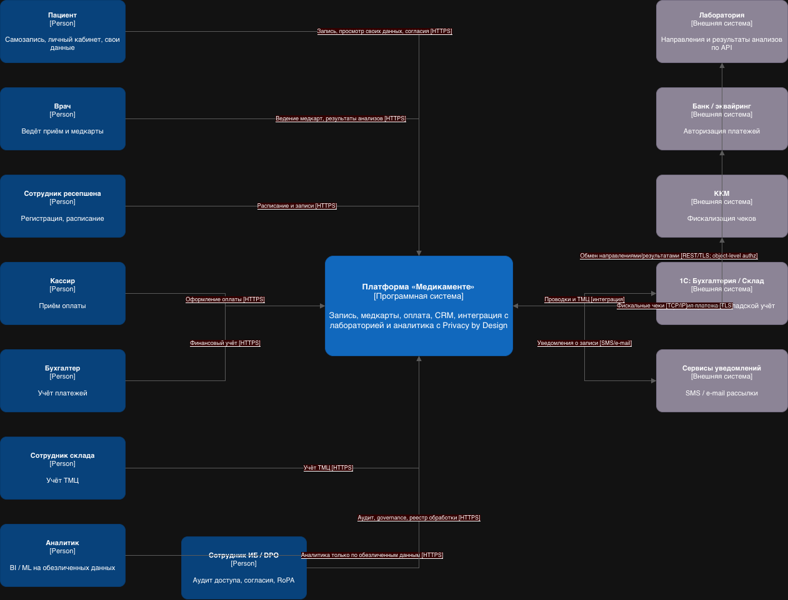

# Task 2 — Проектирование решения (Privacy by Design, To-Be)

## 1. Назначение
Документ описывает целевую архитектуру (To-Be) платформы «Медикаменте» с точки зрения приватности: какие **новые блоки** добавляются в систему, чтобы принципы Privacy by Design были встроены во многие её части **ещё до реализации**, и как устроен **аналитический слой**, работающий с данными системы без риска для конфиденциальности.

Диаграмма контекста (to be):

## 2. Подход Privacy by Design (7 принципов)
1. **Проактивность, а не реакция** — риски предотвращаются на этапе проектирования.
2. **Приватность по умолчанию** — минимум данных, доступ закрыт по умолчанию.
3. **Приватность встроена в дизайн** — защита не «навесная», а часть архитектуры.
4. **Положительная сумма** — функциональность не приносится в жертву приватности (аналитика/ML работают, но без идентифицирующих данных).
5. **Сквозная защита всего жизненного цикла** — от сбора до уничтожения.
6. **Прозрачность и контролируемость** — каталог, аудит, реестр обработки.
7. **Уважение к приватности пользователя** — согласия, доступ к своим данным, право на удаление.

## 3. Новые архитектурные блоки целевой системы (C4)
Целевая система заменяет файловое хранение набором сервисов. Помимо **функциональных** контейнеров (клиентский портал и мобильное приложение, рабочее место врача, портал бэк-офиса, API Gateway, сервисы записи, медкарт, платежей, CRM, адаптер лаборатории, уведомления, операционная БД) вводится отдельный набор **платформенных блоков Privacy by Design** — они и обеспечивают соблюдение принципов «во многих блоках» системы.

| Новый блок                                            | Назначение                                                                                                                             | Принцип PbD | Закрывает (Task 1) |
|-------------------------------------------------------|----------------------------------------------------------------------------------------------------------------------------------------|-------------|--------------------|
| **API Gateway**                                       | единая точка входа: TLS, rate limiting, маршрутизация; контракты скрывают спец. категории                                              | 3, 5        | P-03, P-04         |
| **IAM (Keycloak / AD)**                               | аутентификация, MFA, управление ролями                                                                                                 | 2, 5        | P-04               |
| **PDP — ABAC (OPA)**                                  | централизованная авторизация по тегам данных и атрибутам пользователя; deny-by-default; object-level authz (пациент видит только своё) | 2, 3        | P-04, P-06         |
| **Сервис управления согласиями**                      | фиксирует правовое основание и согласия (152-ФЗ); отзыв согласия → автоматическое прекращение обработки                                | 6, 7        | P-11, P-16         |
| **Каталог + Lineage + Тегирование (DataHub / Atlas)** | классификация и теги данных, происхождение (Data Lineage), реестр обработки ПДн (RoPA)                                                 | 1, 6        | P-12, P-15         |
| **Vault / KMS**                                       | управление ключами, токенизация, crypto-shredding                                                                                      | 5           | P-02, P-03         |
| **Сервис маскирования / обезличивания (pg-anon)**     | динамическое маскирование по ролям; статическое обезличивание для аналитики                                                            | 2, 4        | P-09, P-13         |
| **DLP**                                               | контроль исходящих данных (почта, выгрузки)                                                                                            | 5           | P-14, P-09         |
| **Сервис жизненного цикла (Retention)**               | сроки хранения, безопасное удаление, workflow «право на удаление»                                                                      | 5, 7        | P-11               |
| **Аудит и мониторинг (Elastic + Victoria Metrics)**   | неизменяемые логи доступа к Restricted, обнаружение аномалий, алертинг                                                                 | 1, 6        | P-05               |
| **Операционная БД с доменами (PostgreSQL)**           | разделение категорий по схемам/доменам (identity / medical / finance); field-level шифрование                                          | 3, 5        | P-02, P-06         |

> Большинство блоков покрывается **существующим стеком техдиректора** (PostgreSQL + anon, ClickHouse, Elastic, Victoria Metrics, Kubernetes + Vault, Java) — внедрение не требует новых классов ПО, что снижает стоимость и риск.

### Как PbD оказывается «во многих блоках»
Приватность встраивается не точечно, а как **сквозной слой**: каждый прикладной сервис обязательно проходит через `IAM` (кто) и `PDP/ABAC` (что разрешено по тегам), читает теги из `Каталога`, берёт ключи из `Vault`, отдаёт данные через `Сервис маскирования`, а все обращения к Restricted пишет в `Аудит`. За счёт этого ни один функциональный блок не работает с конфиденциальными данными «в обход» политик.

## 4. Аналитический слой с учётом Privacy by Design
Это отдельный **аналитический контур** (граница доверия), изолированный от операционного. Реализует цель бизнеса «озеро данных для BI/ML/AI», не нарушая минимизацию.

**Состав и поток:**
1. **ETL/ELT с обезличиванием на загрузке** — извлекает данные из операционной БД и **обезличивает их до попадания в озеро**: идентификаторы псевдонимизируются или удаляются, чувствительные значения обобщаются (возраст вместо даты рождения, регион вместо адреса). Правила управляются **тегами из каталога**, происхождение фиксируется в **Lineage**.
2. **Озеро данных / ClickHouse** — аналитическое хранилище, содержащее **только обезличенные данные**.
3. **BI / ML / Jupyter** — рабочее место аналитика; сырые ПДн сюда **не попадают** и не оседают на рабочих станциях (закрывает P-09).
4. **DLP на выгрузках** и контроль реидентификации (k-анонимность, запрет редких срезов).

**Ключевые свойства слоя:**
- Идентифицирующие данные **не покидают операционный контур** — это и есть «приватность по умолчанию» для аналитики.
- Доступ внутри контура тоже управляется `ABAC`; обращения логируются в `Аудит`.
- Реализован принцип **положительной суммы**: ML/BI полностью функциональны, но работают с обезличенными данными — цель «накопить данные для моделей» достигается без обработки ПДн.

## 5. Соответствие принципам Privacy by Design
| Принцип                     | Как реализован в целевой архитектуре                                                                    |
|-----------------------------|---------------------------------------------------------------------------------------------------------|
| 1. Проактивность            | классификация/тегирование, проверка релизов на утечку Restricted, DLP, модель угроз на этапе дизайна    |
| 2. Приватность по умолчанию | ABAC deny-by-default, маскирование по умолчанию, минимизация форм сбора                                 |
| 3. Встроенность в дизайн    | блоки приватности — самостоятельные контейнеры, а не надстройка; разделение доменов в БД                |
| 4. Положительная сумма      | аналитический контур даёт BI/ML на обезличенных данных без потери функциональности                      |
| 5. Сквозная защита          | шифрование at-rest/in-transit, управление ключами, retention и crypto-shredding на всём жизненном цикле |
| 6. Прозрачность             | каталог + RoPA, неизменяемый аудит доступа, журнал согласий                                             |
| 7. Уважение к пользователю  | личный кабинет, управление согласиями, object-level authz, право на удаление                            |

## 6. Границы доверия и локализация
В целевой архитектуре выделены контуры: **DMZ** (приложения + API Gateway), **операционный контур ПДн** (прикладные сервисы + БД), **платформенные сервисы Privacy by Design** и **аналитический контур** (только обезличенные данные). Между сервисами — mTLS. Все данные и резервные копии размещаются **в пределах РФ** (152-ФЗ, требование локализации).
