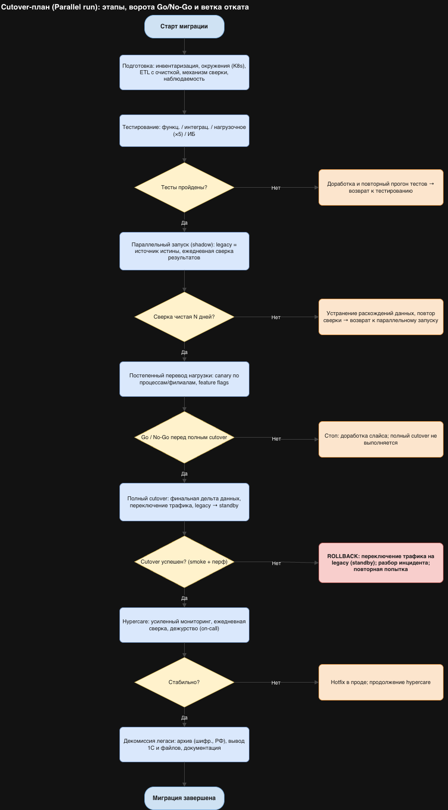

## 1. Анализ ситуации и выбор стратегии
Учёт ведётся на файлах (Excel, медкарты и анализы в папках) и в двух системах 1С в файловом режиме; всё на одном on-prem сервере; IT-команда — 3 человека. Данные — медицинские (спец. категория ПДн, ст. 10 152-ФЗ) и финансовые: цена ошибки и потери данных критична, а операции (приём, оплата) не должны останавливаться.

**Цель миграции.** Единая микросервисная платформа (порталы, платёжный шлюз, CRM, интеграция с лабораторией, озеро данных), рост ×5, открытие филиалов, мобильное приложение и самозапись.

### Сравнение трёх вариантов для этого сценария
| Вариант                   | Суть                                                                         | Применимость здесь                                                                                                                                                                                         |
|---------------------------|------------------------------------------------------------------------------|------------------------------------------------------------------------------------------------------------------------------------------------------------------------------------------------------------|
| **High-level design**     | широкие принципы проектирования (DDD, модульные границы)                     | это про **дизайн** целевой системы, а не про механику переключения; используется как *основа* (границы доменов из Task 2), но не как cutover-стратегия                                                     |
| **Branch by abstraction** | перенос слой за слоем за абстракцией                                         | предполагает **единый кодовый монолит** со «швами»; здесь легаси — это файлы + коробочная 1С, единого кода для абстрагирования нет; годится лишь тактически (напр., абстракция слоя данных при dual-write) |
| **Parallel run** ✅        | старая и новая системы работают параллельно, нагрузка переводится постепенно | **выбран**: даёт проверяемую корректность и дешёвый откат — критично для мед./фин. данных                                                                                                                  |

### Обоснование выбора: Parallel run
**Преимущества для сценария:**
- Легаси остаётся **источником истины**, пока новая система не докажет корректность → нет риска потери/искажения мед. и фин. данных.
- **Дешёвый и быстрый откат**: старая система продолжает работать, переключение трафика обратимо вплоть до декомиссии.
- **Постепенный перевод нагрузки** (по процессам/филиалам) снижает «радиус поражения» ошибки.
- Сверка результатов двух систем — естественный механизм валидации и приёмки.

**Ограничения (и как учтены):**
- Стоимость и трудозатраты на эксплуатацию двух систем → ограничиваем длительность параллельного периода чёткими критериями выхода.
- **Синхронизация данных** между системами — ключевой риск → механизм dual-write/CDC + ежедневная автоматическая сверка с журналом расхождений (см. раздел 4).
- Временный двойной ввод/нагрузка на персонал → автоматизация переноса и сверки, обучение.

> Parallel run операционализирует постепенный подход, рекомендованный в Task 4 (Strangler), а границы доменов из Task 2 (High-level design) служат основой декомпозиции.

## 2. Cutover-план *(формат из задания)*
Роли: **ТД** — техдиректор/архитектор; **DevOps** — сетевой админ/DevOps; **БА** — бизнес-аналитик; **РАЗР** — разработчики; **ИБ** — ИБ/DPO; **ВП** — владельцы процессов; **РУК** — руководство; **ПОД** — поддержка.

| Этап                                 | Описание действия                                                                  | Ключевые задачи                                                                                             | Ответственные       | Время/Сроки    | Риски и меры по снижению                                                                      |
|--------------------------------------|------------------------------------------------------------------------------------|-------------------------------------------------------------------------------------------------------------|---------------------|----------------|-----------------------------------------------------------------------------------------------|
| **1. Подготовка: анализ**            | Инвентаризация данных и процессов, фиксация границ доменов и критериев успеха      | Профилирование данных; правила сверки; baseline-метрики; критерии приёмки и выхода                          | ТД, БА              | Нед. 1–3       | Неполная инвентаризация → пропуск данных; *меры:* чек-листы, профилирование                   |
| **2. Подготовка: среды и данные**    | Развёртывание новой платформы и инструментов переноса/сверки                       | K8s-кластер; ETL с очисткой/нормализацией; механизм dual-write/CDC; наблюдаемость (метрики, трейсинг, логи) | DevOps, РАЗР, ТД    | Нед. 2–5       | Грязные данные, рассинхрон; *меры:* валидация ETL, контрольные суммы                          |
| **3. Тестирование функц./интеграц.** | Проверка сервисов и интеграций (лаборатория, банк, ККМ, 1С), безопасности          | Контрактные тесты; стенды-двойники; тесты шифрования и доступа                                              | РАЗР, БА(QA), ИБ    | Нед. 4–7       | Дефекты интеграций; *меры:* контрактные тесты, изоляция стендов                               |
| **4. Тестирование нагрузочное**      | Нагрузочные/стресс-тесты против baseline (цель ×5), отказоустойчивость             | Профили нагрузки; chaos/failover; проверка автоскейлинга                                                    | DevOps, РАЗР        | Нед. 6–8       | Узкие места производительности (Task 4); *меры:* профилирование, кэш, тюнинг                  |
| **5. Параллельный запуск (shadow)**  | Новая система работает параллельно; legacy — источник истины; ежедневная сверка    | Зеркалирование входных данных; автосверка; журнал расхождений                                               | РАЗР, БА            | Нед. 8–11      | **Расхождение данных (ключевой риск);** *меры:* пороги, ежедневная сверка, разбор расхождений |
| **6. Постепенный перевод нагрузки**  | Перевод по процессам/филиалам (canary); новая система — источник истины для слайса | Feature flags; перевод 1 процесса/филиала; мониторинг слайса                                                | ТД, DevOps, ВП      | Нед. 11–16     | Частичный рассинхрон, ошибки в проде; *меры:* малые шаги, быстрый откат слайса                |
| **7. Ворота Go/No-Go**               | Решение о полном cutover по критериям                                              | Проверка: сверка чистая N дней, перф в SLO, нет P0/P1                                                       | ТД, РУК (+вето ИБ)  | Нед. 16        | Преждевременный переход; *меры:* жёсткие критерии, право вето                                 |
| **8. Полный cutover**                | Финальная синхронизация дельты и переключение всего трафика                        | Окно (ночь/выходные); скрипт финальной дельты; legacy → read-only standby                                   | DevOps, ТД, ПОД     | Нед. 17 (окно) | Окно простоя, потеря последней дельты; *меры:* репетиция cutover, объявленное окно            |
| **9. Мониторинг (hypercare)**        | Усиленное наблюдение после cutover, ежедневная сверка с standby                    | Дежурство on-call; дашборды/алерты; SLA на инциденты; быстрые фиксы                                         | Вся команда, ПОД    | Нед. 17–19     | Всплывшие дефекты, нагрузка на поддержку; *меры:* усиленное дежурство, горячая линия          |
| **10. Декомиссия легаси**            | Вывод старой системы после стабилизации                                            | Архив данных (шифр., в РФ); вывод 1С/файлов; финализация документации                                       | ТД, ИБ, бухгалтерия | Нед. 20+       | Потеря истории, регуляторика; *меры:* проверенный архив, сроки хранения, акт вывода           |

## 3. Этапы и критические моменты (пояснение)
План делится на **подготовку** (этапы 1–2), **тестирование** (3–4), **реализацию** (параллельный запуск и постепенный перевод, 5–6), **переключение и мониторинг** (8–9) и **завершение** (10), а **план отката** доступен на всём пути (раздел 5). Критические моменты:
- **Чистота сверки в параллельном запуске** — пока данные двух систем расходятся, нагрузку не переводим.
- **Ворота Go/No-Go** (этап 7) — единственная точка принятия решения о полном переходе; критерии жёсткие, у ИБ право вето.
- **Окно полного cutover** (этап 8) и финальная синхронизация дельты — выполняется по отрепетированному сценарию в нерабочее время.
- **Первые часы hypercare** — пик вероятности проявления дефектов.

## 4. Ключевые риски стратегии и управление ими
| Риск (специфичный для Parallel run)                                   | Мера снижения                                                                                                          |
|-----------------------------------------------------------------------|------------------------------------------------------------------------------------------------------------------------|
| **Синхронизация данных** между legacy и новой системой (главный риск) | dual-write/CDC + **ежедневная автоматическая сверка**, журнал расхождений, пороги допустимых отклонений, ручной разбор |
| Двойной ввод и нагрузка на персонал                                   | автоматизация переноса/сверки, обучение, временное усиление поддержки                                                  |
| Стоимость эксплуатации двух систем                                    | ограничение длительности параллельного периода критериями выхода                                                       |
| Расхождение бизнес-логики (старая vs новая)                           | сверка результатов на эталонных кейсах, приёмка владельцами процессов                                                  |
| Откат после частичного перевода                                       | legacy в режиме standby как источник истины до декомиссии; обратимое переключение по слайсам                           |

## 5. План действий при проблемах (откат)
**Триггеры отката:** расхождение сверки выше порога; инцидент уровня **P0** (недоступность/потеря данных); нарушение перф-SLO во время/после cutover.
**Процедура:** переключить трафик обратно на **legacy (standby)**, который остаётся источником истины → откатить/повторно применить дельту → зафиксировать инцидент → разбор (post-mortem) → доработка и повторная попытка. Пока легаси не декомиссирована, откат малозатратен.
**Уровни инцидентов и эскалация:** P0 — немедленная эскалация ТД, решение об откате; P1 — фикс в hypercare; P2 — плановое устранение. На время cutover — «военная комната» (war-room) и заранее согласованный канал связи.

## 6. Распределение ролей и ответственности
| Роль                                       | Зона ответственности                                                                   |
|--------------------------------------------|----------------------------------------------------------------------------------------|
| **Технический директор / архитектор (ТД)** | владелец миграции, границы доменов, решения Go/No-Go и отката                          |
| **Сетевой админ / DevOps**                 | инфраструктура (K8s), развёртывание, выполнение cutover, мониторинг                    |
| **Бизнес-аналитик (БА)**                   | требования, правила сверки, координация тестирования и приёмки, связь с пользователями |
| **Разработчики (РАЗР)**                    | сервисы, механизм синхронизации, исправления дефектов                                  |
| **ИБ / DPO**                               | шифрование, доступ, соответствие 152-ФЗ; право вето на Go/No-Go; архивирование         |
| **Владельцы процессов (ВП)**               | приёмка по слайсам (ресепшен, касса, бухгалтерия, врачи), валидация бизнес-логики      |
| **Руководство (РУК)**                      | бизнес-решение Go/No-Go, коммуникация, ресурсы                                         |
| **Поддержка (ПОД)**                        | hypercare, помощь пользователям, регистрация инцидентов                                |

> Команда мала (3 IT) — роли совмещаются; на период миграции рекомендовано временное усиление экспертами по микросервисам/K8s и выделение дежурства (связано с рекомендациями Task 4). Сроки укрупнённые и подлежат уточнению по итогам этапа подготовки.

Блок-схема плана с воротами Go/No-Go и веткой отката:

